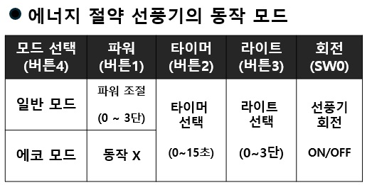
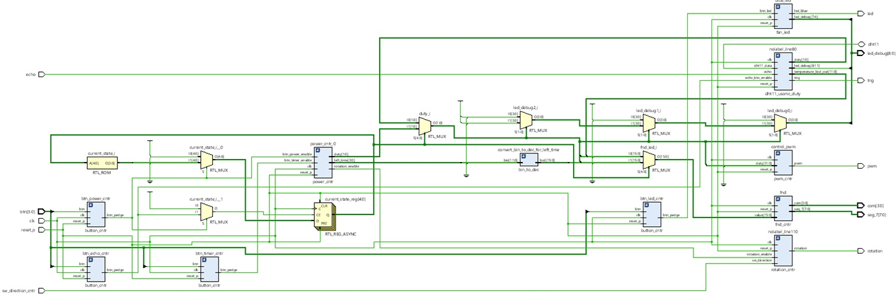
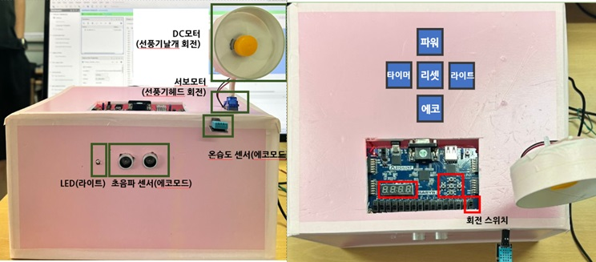

## Team-Project_Multifunctional-Energy-Saving-Fan

### 1. 목적
- 에너지 절약 선풍기 제작을 통한 Basys3 FPGA Board, 초음파 센서, DHT11 조작 및 이해

### 2. 프로젝트의 목표
- 버튼 및 타이머를 통한 선풍기 파워 제어 구현
- 온습도 센서, 초음파 센서를 이용한 선풍기 제어
- 서보 모터를 통해 선풍기 회전 구현
- 에코 모드 (절전 모드) 구현

### 3. 동작 모드

  

### 4. Hardware / Software Design Diagram

  
  

### 5. RTL Schematic

  

  

### 6. Implementation

  

  
